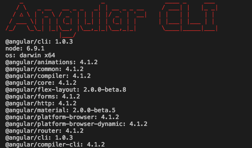

# PangoWeb

To run this project and/or begin developing for this project. There are a few prerequisites

## Prerequisites 

### Install Node
  * Download the correct installer from here: https://nodejs.org/en/download/ 
  * After installation run the following commands from your terminal/command line to ensure that you have them installed correctly:
    * `node -v`
    * `npm -v`

### Install Angular Cli
After you have verified your node installation, run the following command from your terminal/command line:

```
npm install -g @angular/cli
```

Once the installation completes, verify the installation by running the following command:

```
ng -v
```

You should see a picture simular to the following:



## Run app server

After you have followed the steps above run the following command:
```
ng serve --open
```

Your browser should open to the appropriate page and you should be able to view the site.

